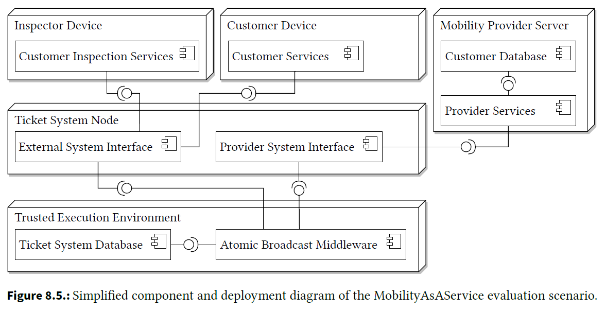

 
    <h3 align="center"> 
    Evaluation Scenario: Mobility as a Service</h3>

&nbsp;

## ABUNAI - Evaluation Scenario: Mobility as a Service

Mobility as a Service is one of six scenarios used in the initial evaluation of the ABUNAI approach to uncertainty-aware confidentiality analysis. Please see the following table for an overview of the criteria of all evaluation scenarios:

| Name                | # Component | # SEFF | # TFG | # Vertex | # Uncertainty | # Violation |
|---------------------|-------------:|--------:|-------:|----------:|----------------:|--------------:|
| [TravelPlanner](https://github.com/DataFlowAnalysis/DataFlowAnalysis)       | 7           | 9      | 2     | 42       | 1              | 1            |
| [DistanceTracker](https://github.com/DataFlowAnalysis/DataFlowAnalysis)     | 8           | 10     | 1     | 29       | 1              | 1            |
| [OnlineShop](https://github.com/abunai-dev/EvaluationScenario-OnlineShop)          | 2           | 6      | 3     | 44       | 4              | 24           |
| [CoronaWarnApp](https://github.com/abunai-dev/EvaluationScenario-CoronaWarnApp)       | 21          | 58     | 14    | 687      | 9              | 163          |
| ***[MobilityAsAService](https://github.com/abunai-dev/EvaluationScenario-MaaS)***  | ***18***          | ***49***     | ***8***     | ***200***      | ***5***              | ***6***            |
| [JPlag](https://github.com/abunai-dev/EvaluationScenario-JPlag)               | 3           | 5      | 3     | 65       | 4              | 26           |

For further information, please see the [dissertation](https://doi.org/10.5445/IR/1000178700) *Chapter 8* on the evaluation scenarios. There, the following figure summarizes the architecture of this evaluation scenario:

